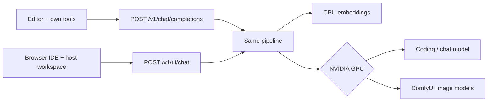

# tabbyapi-stack - Chat/IDE Web UI using self hosted LLM on ArchLinux

A self-hosted coding assistant, web workspace, and image generator for an Arch Linux machine with an NVIDIA GPU.

From the official Arch live ISO, the **tsos installer** (`tsos-installer.sh`) starts with **Simple** setup: a review menu for disk, hostname, username, weights source (Hugging Face, USB, or a path), and whether other computers on the LAN can connect. Open a row to change it, then start the install. Choose **Advanced** for encryption, Omarchy, extra models, and SSH tunnels. It then installs Arch and this stack in one pass:

```bash
curl -fsSL https://raw.githubusercontent.com/styelz/tabbyapi-stack-archlinux/main/tsos-installer.sh | bash
```

Use it from Cursor, VS Code, Continue, Cline, another OpenAI-compatible client, or the built-in browser IDE. Editors keep their own tools and files. The browser Code tab is a self-contained IDE on this host that uses the same Chat Completions API. Prompts, project files, and generated images stay on hardware you control.

## What you get

- An OpenAI-compatible API for local chat, tool use, vision, and embeddings
- Switchable language-model profiles tuned for a 12 GB NVIDIA card
- Flux Schnell and Qwen-Image through ComfyUI
- A browser UI with Chat and Code workspaces, status graphs, logs, a gallery, and user accounts
- A guided Arch installer plus systemd startup, updates, and an optional HTTPS reverse tunnel

The language model and ComfyUI share one GPU. TabbyAPI Stack unloads one before starting the other; the CPU embedding model can remain available throughout.



## Install

**Fresh machine:** boot the official Arch live ISO and run the tsos installer. It does not reboot until Arch and `install.sh` finish. After reboot, linger starts the API.

```bash
curl -fsSL https://raw.githubusercontent.com/styelz/tabbyapi-stack-archlinux/main/tsos-installer.sh | bash
```

**Already-installed Arch:** NVIDIA GPU, internet, and enough disk for the selected model set. Run as your normal user, not as root.

```bash
sudo pacman -S --needed git
git clone https://github.com/styelz/tabbyapi-stack-archlinux.git "$HOME/tabbyapi-stack"
cd "$HOME/tabbyapi-stack"
bash install.sh
```

The installer starts with **Simple** setup (a review menu: this PC vs LAN; core models from Hugging Face into `$HOME/tabbyapi-stack`; TTY screensaver on). Choose **Advanced** for a USB cache, extra models, bind address, public URL, reverse SSH tunnel, or to turn the screensaver off.

Simple uses the **core** set (qwen 9B, Flux, Qwen-Image, CPU embedder). Advanced can add every larger switchable model profile (`all`).

It is safe to run the installer again: existing weights are skipped. For USB caches, unattended installation, network settings, and recovery steps, use the [complete Arch install guide](tabbyAPI/deploy/arch/README.md).

For a bootable USB image, build or download the [TSOS Arch Linux ISO](iso/README.md).
It is a small live installer: Arch packages, Python, PyTorch, and weights
download at install time. Older frozen 9 GiB releases still work.

## Start and sign in

The installer enables a user service that starts at boot, even before login.

```bash
curl -sS http://127.0.0.1:5000/health
systemctl --user status tabbyapi
journalctl --user -u tabbyapi -f
```

Open `http://127.0.0.1:5000/v1/ui` on the GPU host, or `/v1/ui` under the public URL you configured. Sign in with the Linux account that installed the stack.

The first account is the administrator. It can create separate Tabby-only accounts from **Users**; those accounts do not become Linux users. Conversations, Code projects, and images are kept per account, while the administrator can manage users and view all gallery images. Each signed-in account can **Download backup** / **Restore backup** from the account menu; the zip is that account only. After a fresh install, recreate extra Tabby users, then each person restores their own zip.

## Use the browser UI

**Chat** is the same Chat Completions pipeline as an editor, without file tools. Use it for conversations, pasted images, model commands, and image generation. It keeps searchable history and lets you queue a follow-up while a reply is running. If another signed-in account or an editor is already using the GPU, you wait in a queue.


**Code** is a self-contained IDE per project folder. Extra chats under that workspace share the same files. The browser is the agent: it calls the same Chat Completions API as an editor, then runs Grep, Glob, Read, Write, Shell, and the other workspace tools against the jailed project on this host. **Agent** can write; **Ask** and **Plan** only inspect. Upload files, edit in Monaco, preview an HTML site, use a per-chat container terminal, or download the project as a zip.


Other pages:

| Page | What it is for |
|---|---|
| **Status** | Loaded profile, GPU mode, occupancy queue, health, CPU/RAM/NVIDIA metrics, model switching, restart, and updates |
| **Gallery** | Preview and download generated images; administrators can see all users |
| **Logs** | Live and historical TabbyAPI and ComfyUI output |
| **Users** | Administrator-only account creation, password reset, and deletion |
| **Settings** | Administrator-only Tabby `config.yml`, system `tabby.env`, screensaver, and GPU fan/power. Shell: `tsctl` |


## Connect an editor

Configure an OpenAI-compatible provider in your editor:

| Setting | Value |
|---|---|
| Base URL | `http://<gpu-host>:5000/v1` on a trusted LAN/Tailscale network, or your configured HTTPS `/v1` URL |
| Model name | `gpt-4o` |
| API key | Your UI login password (Linux account password for the stack admin, or the password set on the Users page for extra Tabby accounts) |

Leave the model name as **`gpt-4o`**. It is only a compatibility label that keeps editor tool support enabled; inference still runs on the local profile shown by `list models` or the Status page. Do not send Tabby workspace tools from an editor — the editor already has its own.

Some clients require HTTPS. The installer can configure a reverse SSH connection to a host that already has a valid certificate. Details are in the [network section of the install guide](tabbyAPI/deploy/arch/README.md#1-fresh-machine-github).


## Commands

Send commands as the entire message. `switch to qwen` is the usual form; `please switch to qwen` also works.

| Message | Result |
|---|---|
| `help` | Show the current in-chat user guide |
| `list models` | List installed profiles and mark the loaded one |
| `restart` | Restart the API and reload the last language model |
| `switch to qwen` | Load the everyday coding profile |
| `switch to qwen35` / `switch to qwen36` | Load a larger profile for long or difficult work |
| `switch to gemma` / `switch to gemma26` | Load a general-purpose profile |
| `switch to glm` | Load the thinking chat profile (no coding tools) |
| `switch to comfy` / `switch to flux` | Unload the language model and start image generation |
| `switch to llm` | Stop ComfyUI and restore the last language model |

Only installed profiles appear in `list models`. Warm switching on an RTX 4070 Ti 12 GB ranges from about 15 seconds to 3 minutes; a first boot can take longer while Triton compiles.

## Generate images

For a single image, ask directly:

```text
generate an image of a neon diner on a rainy street at night
```

TabbyAPI Stack moves the GPU to ComfyUI, creates the image, returns a URL from the same server, and restores the previous language model. To make several images without reloading the model between each one, use `switch to comfy`, send prompts, then `switch to qwen`.

- Flux Schnell is the default for photos, scenes, drafts, and img2img.
- Prefix a prompt with `qwen-image:` for logos, posters, interface mockups, or readable text.
- Attach a source image in the same message for Flux img2img.
- Generated files also appear in **Gallery**.

OpenAI-compatible clients can call `POST /v1/images/generations`; the response contains both `b64_json` and a server URL.

For editor agents that build pages with generated assets, see [AGENTS.md](AGENTS.md). No extra image plugin or `mcp.json` is required.

## Update

Run this on the GPU host:

```bash
bash "$HOME/tabbyapi-stack/update.sh"
```

- **Update git** pulls code and optionally restarts the service.
- **Update all** pulls code, refreshes dependencies, restarts, and waits for health.
- `--comfy` additionally updates ComfyUI and ComfyUI-GGUF.

The same actions are available on **Status**. Updates preserve `config.yml`, `tabby.env`, model weights, and the virtual environment. They do not run a full Arch system upgrade.

## More documentation

- [Arch installation and troubleshooting](tabbyAPI/deploy/arch/README.md)
- [Editor and agent behavior](AGENTS.md)
- [Upstream TabbyAPI documentation](tabbyAPI/README.md)

## License

TabbyAPI is [AGPL-3.0](LICENSE), matching [upstream TabbyAPI](https://github.com/theroyallab/tabbyAPI). ComfyUI, custom nodes, and model weights retain their own licenses.
